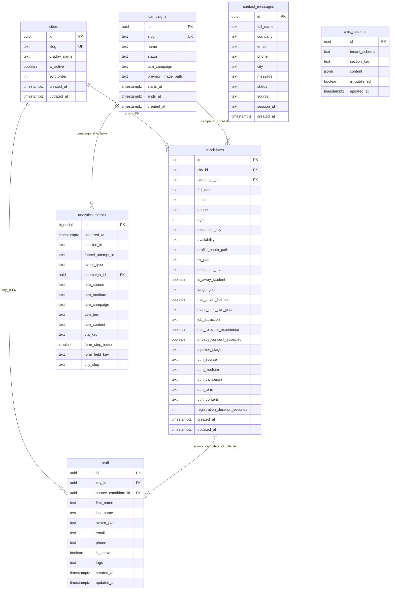

# Concept: campagne, analytics, città e pre-wiring Supabase

Documento **solo concettuale** (pre-coding): allinea prodotto e modello dati prima del wiring effettivo su Supabase.  
Riferimenti incrociati: [`DB_CMS_INTEGRATION.md`](DB_CMS_INTEGRATION.md) (layer dati pianificato), [`DEVELOPMENT_NOTES.md`](DEVELOPMENT_NOTES.md) (stato implementativo admin).

---

## Indice decisioni

| # | Tema | Stato concept |
|---|------|----------------|
| 0 | **Pagina Auth admin** | Milestone esplicita — UI standard allineata al gestionale |
| 1 | Campagne (sidebar, UTM, estensioni candidato) | Policy 3 + UTM congelati |
| 2 | Overview + tabella analytics | `event_type` v1 congelato |
| 3 | Quinta colonna board | **Placeholder** — da integrare con appunti |
| 4 | Viste candidati realmente per città | Chiaro a livello prodotto |
| 5–6 | Città gestite + step form | **Cuore:** tabella `cities` |
| 7 | RLS / ruoli | Bozza policy |

---

## 1) Campagne (sidebar + scheda)

### Obiettivo prodotto

- Nuova voce sidebar **Campagne**.
- Vista che supporta:
  - **overview** campagne attive e storico (campagne passate visibili);
  - **generazione / gestione UTM** (coerenza parametri, naming, copia rapida);
  - **anteprima immagine** (es. story IG sponsorizzata) — Storage Supabase + URL pubblico o signed dove serve.

### Più campagne simultanee

Ammesso per design: una campagna è un’entità con ciclo di vita (attiva/archiviata/data fine); più record contemporanei “attivi” ok se utile operativamente, oppure un solo flag “active” per tenant con altre in pausa — **da scegliere in UX** (non blocca schema).

### Estensioni tabella / modello **Candidati**

Aggiunte concettuali (oltre ai campi già previsti):

| Campo concettuale | Tipo | Note |
|-------------------|------|------|
| `utm_source`, `utm_medium`, `utm_campaign`, `utm_term`, `utm_content` | text nullable | Standard UTM; valorizzati da landing/query string persistiti al submit. |
| `registration_duration_seconds` | integer nullable | Solo per funnel da **prima vista** form candidatura a **invio**; se abbandono, nullo o non aggiornato (meglio non “inventare” durate). |
| `campaign_id` | uuid nullable FK → `campaigns` | Opzionale ma consigliato se le campagne vivono in DB; altrimenti coerenza solo via UTM string. |

**Nota:** `registration_duration_seconds` richiede nel client due timestamp (view form, submit) e calcolo secondi; privacy/bias: accettabile se solo durata aggregata in analytics.

### Cosa manca / da decidere

- Campo **`campaign_id` vs solo UTM**: FK rende report più puliti; UTM soli bastano per MVP ma duplicano logica di matching.
- Politica **immagine**: bucket dedicato `campaign-previews`, path `campaign_id/...`, RLS upload solo admin.

---

## 2) Overview dashboard + analytics

### Principio: tracciamento smart e leggero

Evitare colonne ridondanti tipo `rinuncia` + `rinuncia_dove`: preferire **un evento una riga** (append-only) con colonne che significano qualcosa **solo quando l’evento lo richiede** (pattern “detail implies event type”, non boolean duplicati).

### Modello consigliato: tabella eventi (`analytics_events`)

Grano consigliato: **evento atomico** con tipo discriminante.

**Colonne “strette” (sempre o quasi):**

- `id` (bigserial/uuid), `occurred_at` (timestamptz), `session_id` (text/uuid — generato client, cookie/localStorage).
- `event_type` (enum/string controllato): set v1 congelato in § *Decisioni congelate* (`page_view`, `cta_click`, `careers_form_open`, `careers_step_view`, `careers_abandon`, `careers_submit`).
- `utm_source`, `utm_medium`, `utm_campaign`, `utm_term`, `utm_content` (nullable — denormalizzati dalla sessione al momento dell’evento per integrità storica).
- `campaign_id` (uuid nullable FK → `campaigns`) quando arriva da `cid` o matching affidabile.
- `funnel_attempt_id` (uuid/text nullable): valorizzato sugli eventi funnel careers per dedup e audit di `careers_abandon`.

**Colonne di dettaglio “una sola semanticamente”:**
- `dwell_seconds` (integer nullable): usato per `site_view` (permanenza pagina) o heartbeat; null se non pertinente.
- `cta_key` (text nullable): identificatore stabile del CTA (es. `hero_richiedi_incontro`); valorizzato solo se `event_type = cta_click`.
- `form_step_index` (smallint nullable) + `form_field_key` (text nullable): per abbandono, valorizzare **solo** `form_field_key` (e opzionalmente step) sull’evento `form_careers_abandon` → **non serve** `rinuncia boolean` separato: l’evento *è* la rinuncia.
- `city_slug` (text nullable): per **conversione** candidatura o contesto geografico scelto; su `form_careers_submit` valorizzato = “conversione con città X”. **Non serve** `conversione boolean` separata se `event_type = form_careers_submit` implica conversione funnel careers.

**Conversioni “per città”:** aggregare in query: `WHERE event_type = 'form_careers_submit' GROUP BY city_slug`.

**Rinunce durante compilazione:** evento singolo `form_careers_abandon` con `form_field_key` = ultimo campo “noto” prima di uscire (o step) — richiede instrumentazione JS (beforeunload / visibility / step change) — **da definire precisione** (solo step esplicito vs best-effort).

### Città di origine traffico / geo

- **Geo IP** nel browser: impreciso, privacy, GDPR — sconsigliato come default.
- Alternative leggere:
  - **Lingua browser** (`navigator.language`) come proxy culturale — opzionale, poco affidabile.
  - **Solo UTM + referrer** (se non strippato) come dimensione marketing; referrer spesso vuoto — opzionale colonna `referrer_host` nullable.
- Se in futuro servisse geo reale: farlo **lato server** (Edge) con conservatorismo e policy privacy, non nel MVP.

### Cosa manca / da decidere

- Unificare **contatti clienti** in tabella dedicata (`contact_submissions`) vs eventi analytics: concettualmente **tabelle diverse** (messaggio ha corpo PII); collegamento opzionale `session_id`.
- **UPDATE su `analytics_events`:** in modello append-only **non serve** UPDATE; correzioni = nuova riga o job admin con service role. Se serve “merge session” lazy, valutare tabella `sessions` aggregata aggiornabile + eventi raw (due layer) — solo se la complessità lo giustifica.

---

## 3) Quinta colonna board candidati

**Placeholder:** integrare quando recuperi gli appunti. A livello schema, potrebbe richiedere un nuovo campo pipeline o una colonna virtuale derivata da stato — nessun vincolo finché non è definito il workflow.

---

## 4) Viste candidati / città autonome

### Problema attuale

Le viste “per città” non riflettono una separazione dati reale (stesso blob o filtro insufficiente).

### Direzione

- Ogni candidato ha **`city_id` FK** allineato alla tabella **città** (vedi §5–6); lo slug resta disponibile come valore leggibile/denormalizzato per URL, export e analytics.
- Board e liste filtrano **per città selezionata** in routing o contesto URL (`/candidati/modena` → solo `city_id = …`).
- **RLS admin (fase 2):** opzionale restrizione per operatore solo su alcune città; in v1 “utente auth vede tutto” come da §7.

---

## 5–6) Gestione città (admin) e step form candidatura — come collegarli

### Principio unico

**Una tabella `cities` (o `office_locations`) è la single source of truth** per:

- ciò che l’admin può creare/disattivare;
- ciò che il form pubblico mostra nello step “Scegli la città”.

Così punto 5 e 6 restano **automaticamente allineati**: nessuna doppia lista hardcoded nel repo.

### Schema logico minimale `cities`

| Colonna | Scopo |
|---------|--------|
| `id` | uuid PK |
| `slug` | text UNIQUE, stabile (`modena`, `sassari`, `bologna-2027`) — usato in URL/API e in analytics |
| `display_name` | text per UI (“Modena”) |
| `is_active` | boolean — se false, **non** compare nel form pubblico (e opzionalmente nascosta in creazione nuova candidatura in admin o solo in modifica storica) |
| `sort_order` | int — ordine nello step form e in admin |
| `created_at`, `updated_at` | audit |

Opzionale: `metadata` jsonb (timezone, codice telefonico, note interne).

### Flusso admin (punto 5)

- CRUD Campagne/Città (o pagina Impostazioni “Sedi”): INSERT = nuova città disponibile **se `is_active = true`**.
- Board e filtri usano gli stessi record (nessun enum TypeScript come unica verità — l’enum diventa derivato o si elimina a favore di fetch).

### Flusso web (punto 6)

- Nuovo step form: **select** ordinato delle righe `cities WHERE is_active = true`.
- Al submit candidatura: inviare `city_id` per `candidates`; derivare `city_slug` per `analytics_events` quando serve una dimensione leggibile/denormalizzata.

### Perché `slug` + `id`

- **`id`** per integrità FK nel DB.
- **`slug`** per URL leggibili, log, UTM landing per città se mai servisse, e per non rompere export se rinominano il display name.

### Migrazione da oggi (Modena / Sassari hardcoded)

- Seed iniziale due righe + script/migrazione che mappa dati legacy `city_code` → `city_id`.

### Cosa manca / da decidere

- **Disattivare una città** con candidati esistenti: policy consigliata — non cancellare row; `is_active = false` nasconde solo per *nuovi* form; storico admin mostra sempre etichetta risolta.
- **Permessi:** chi in admin può creare città? (tutti gli autenticati in v1, ok.)

---

## 7) Pre-wiring Supabase e RLS (bozza)

### Ruoli concettuali

- **Visitatore anonimo (sito pubblico):** chiave anon; politiche restrittive per tabella.
- **Utente autenticato admin:** Supabase Auth; politiche permissive sulle tabelle backoffice (o schema `admin`).

### Matrice indicativa (da tradurre in policy SQL)

| Tabella | Pubblico anon INSERT | Pubblico anon SELECT | Pubblico anon UPDATE | Admin autenticato |
|---------|---------------------|----------------------|----------------------|-------------------|
| `cities` | no | solo `is_active = true` (per popolare form) | no | full |
| `candidates` / candidature | sì (submit form) | no (PII) | no | full |
| `analytics_events` | sì | no | solo se davvero serve patch sessione — **meglio no** | full |
| `contact_messages` | sì | no | no | full |
| `campaigns` | no | no | no | full |
| `cms_sections` | no | read published se previsto | no | full |
| `staff` | no | no | no | full |

**Nota sicurezza:** INSERT pubblico su `candidates` richiede **validazione** (RLS + check + rate limit Edge/Supabase Functions) per evitare spam; stesso per `analytics_events` (volume).

**UPDATE analytics:** ripetiamo — **sconsigliato** per anon; se serve aggiornare una sessione, meglio **nuovo evento** o tabella `sessions` con RLS diversa.

### Admin “può fare tutto”

Implementazione tipica: policy `auth.role() = 'authenticated'` (e in futuro claim `admin`) su tutte le tabelle operative; mai esporre operazioni distruttive al solo anon key senza guardrail.

---

## Milestone esplicita — Pagina Auth (admin)

Obiettivo: introdurre **login Supabase Auth** prima (o in parallelo stretto) al wiring dati sensibili, con interfaccia **standard** e coerente col gestionale.

### Requisiti UI/UX

- **Route dedicata** (es. `/login` o `/auth`) fuori dalla shell sidebar principale: layout semplice (sfondo neutro / brand sobrio come dashboard login enterprise).
- **Componenti**: modulo centrato (`Card` + campi email/password o flusso magic link se abilitato nel progetto Supabase); messaggi errore chiari; stato caricamento sul submit.
- **Allineamento visivo**: riuso palette tipografia/spacing già usati in admin (`Sidebar`, `Settings`, bottoni primari); logo o nome prodotto in header compatto della card — niente UI “generica” staccata dal resto del backoffice.
- **Funzioni minime**: accesso; redirect post-login alla dashboard o alla route richiesta; link **recupero password** (Supabase); gestione sessione (logout in header/sidebar quando integrato).
- **Protezione route**: wrapper/guard sulle route admin (tutte tranne `/login` e asset statici); finché non c’è wiring, il guard può restare mock con flag dev.

### Ordine rispetto al wiring DB

La pagina Auth **non dipende** dalle migrazioni CRM/analytics ma **abilita** RLS “authenticated full” in modo realistico (test con utente reale). Convive con la milestone “ultima vista” prodotto: schedulare Auth **prima** di esporre dati PII da Supabase in admin.

---

## Prossimo passo (da congelare prima del primo sprint di codice)

Questo è il livello di dettaglio immediatamente utile dopo aver letto il doc: due decisioni che **bloccano schema e instrumentazione SDK**. Il resto (board colonna 5, UX campagne multi-attive) può seguire in parallelo ma non blocca il tipo delle colonne SQL.

### Decisioni congelate (scelte operative)

Di seguito le scelte adottate per il progetto, con motivazione sintetica.

#### A — Campagne: **Policy 3 (ibrido)**

- **Persistenza:** sempre colonne **`utm_source`, `utm_medium`, `utm_campaign`, `utm_term`, `utm_content`** su candidato e sugli eventi (storico fedele al click; compatibile con link creati fuori dall’admin).
- **FK:** **`campaign_id` uuid nullable** su candidato (e dove serve sugli eventi in ingest).
- **Propagazione:** il builder in admin produce URL con **UTM standard** + parametro **`cid=<token-corto>`** (tracking pubblico), mentre l'identificatore canonico resta `campaigns.id` (uuid). Il client web legge `cid`, risolve la campagna (lookup su `campaigns.cid`) e invia/deriva `campaign_id` uuid su candidatura ed eventi; se manca `cid` (solo UTM da ads esterne), **`campaign_id` resta null** — accettabile; eventuale job notturno può fare match `utm_campaign = campaigns.slug` solo se lo **slug è stabile e univoco** e documentato come regola di matching.
- **Perché non Policy 1 o 2:** la 1 rinuncia ai KPI puliti sulla scheda Campagna; la 2 esclude traffico legittimo senza `cid`. L’ibrido massimizza copertura marketing reale **e** qualità dei report quando usi il gestionale come sorgente link.

#### A.1 — Stato campagna (decisione operativa)

- **Attivazione campagna:** `first_data_at` si valorizza al primo `page_view` con `cid` valido; `last_data_at` si aggiorna a ogni evento attribuito alla campagna (`page_view`, `cta_click`, `careers_*`).
- **Stato derivato:** nessuna colonna `status` persistita in v1; lo stato UI si calcola runtime da timestamp (`No dati` se `first_data_at` nullo, `Attiva` se `last_data_at` entro 5 giorni, altrimenti `Disattiva`).
- **Perché questa scelta (2 righe):** il primo `page_view` è il segnale più precoce e stabile di utilizzo reale della campagna, senza dipendere da submit o conversioni. Calcolare lo stato in query evita cron/job anticipati e riduce rischio di drift tra dato raw ed etichetta visualizzata.

#### B — Analytics: **set `event_type` v1 come da tabella sotto**

- **Permanenza pagina:** in **v1 non** si emette `dwell_seconds` su `page_view` (si possono comunque registrare `page_view` senza dwell). Il heartbeat aggiunge complessità client, tabella piena e casi edge (tab in background); si reintroduce quando la dashboard lo richiede.
- **Abbandono:** **solo granularità step** — su `careers_abandon` si valorizza **`form_step_index`** (obbligatorio) e **`form_field_key` opzionale** solo se già disponibile senza euristiche fragili (es. ultimo campo con blur valido). Nessun inventario “per ogni input” obbligatorio in v1.
- **Perché:** rapporto migliore tra segnale utile e rumore/false rinunce rispetto al field-level ovunque.

| `event_type` (v1 congelato) | Quando | Colonne oltre base (UTM, `session_id`, timestamp) |
|-----------------------------|--------|--------------------------------------------------|
| `page_view` | Caricamento route/pagina rilevante (home, careers, landing) | nessuna obbligatoria; niente `dwell_seconds` in v1. |
| `cta_click` | Click CTA instrumentato | `cta_key` obbligatorio. |
| `careers_form_open` | Primo mount del form candidature (inizio timer durata registrazione) | nessuna obbligatoria. |
| `careers_step_view` | Ingresso step (incluso step città quando esiste) | `form_step_index` obbligatorio. |
| `careers_abandon` | Uscita funnel senza submit (regola UX: vedi implementazione; best-effort) | `form_step_index` obbligatorio; `form_field_key` opzionale. |
| `careers_submit` | Submit riuscito | `city_slug` denormalizzato dalla città scelta; il record `candidates` mantiene `city_id` FK. |

Fuori da v1: geo IP, timezone dedicati, UPDATE su righe evento.

#### Derivazioni dashboard (invariate)

- Conversioni per città: `careers_submit` + `city_slug`.
- Rinunce: `careers_abandon` per `form_step_index` (e opzionalmente campo).
- Campagne: join per sessione / UTM / `campaign_id` quando presente.

---

### Riferimento — Perché esistevano tre policy campagna (storico decisionale)

| Policy | Contenuto |
|--------|-----------|
| 1 — Solo UTM | Nessun FK fino a vista Campagne stabile. |
| 2 — FK obbligatorio | Più rigido; penalizza traffico senza builder. |
| 3 — Ibrido | **Scelta congelata:** UTM sempre + `campaign_id` nullable via `cid` o match ritardato. |

---

## Inventario `cta_key` (web — stato codice attuale)

### Convenzione

- **`snake_case`**, stabile nel tempo: non legare il nome al copy CMS (il label può cambiare).
- Pattern suggerito: `{area}_{azione_o_destinazione}` (es. `hero_scroll_indicator` se si traccia il cue scroll).
- Valori inviati solo con evento **`cta_click`** (`cta_key` obbligatorio).

### Tabella — anchor e azioni navigazione

Percorsi effettivi derivati da `web/data/site-content.ts`, `web/data/navigation.ts`, componenti.

| `cta_key` | Dove | Azione / href tipico | Note |
|-----------|------|----------------------|------|
| `nav_logo_home` | `navbar.tsx` | `#` (top) | Logo click. |
| `nav_anchor_about` | Navbar desktop/mobile | `#about` | |
| `nav_anchor_clients` | Navbar | `#clients` | |
| `nav_anchor_why_g3` | Navbar | `#why-g3` | Non è nei quick link footer (`showInFooter: false`). |
| `nav_anchor_contact` | Navbar | `#contact` | |
| `nav_anchor_careers` | Navbar | `#careers` | |
| `hero_primary_contact` | `hero.tsx` | `#contact` | Copy da CMS (`primaryCta.label`). |
| `hero_secondary_careers` | `hero.tsx` | `#careers` | Copy da CMS. |
| `footer_quick_about` | `footer.tsx` | `#about` | Link rapidi (subset nav). |
| `footer_quick_clients` | `footer.tsx` | `#clients` | |
| `footer_quick_contact` | `footer.tsx` | `#contact` | |
| `footer_quick_careers` | `footer.tsx` | `#careers` | |
| `footer_tel_primary` | Footer contatti | `tel:+393491767260` | |
| `footer_mail_info` | Footer | `mailto:info@g3modena.com` | |
| `footer_mail_mediterraneo` | Footer | `mailto:mediterraneo@g3modena.com` | |

### Tabella — form (non sono `cta_click`)

Per il modello v1 congelato questi eventi **non** usano `cta_key`:

| Elemento | Evento analytics previsto | Note |
|----------|---------------------------|------|
| Invio **contatti** (`contact-form.tsx`, submit “Invia richiesta”) | Tabella **`contact_messages`** + eventualmente tipo dedicato in analytics **post-v1** | Non duplicare PII in `analytics_events` senza policy chiara. |
| **Careers**: “Avanti”, “Indietro”, “Invia candidatura” | **`careers_step_view`** / **`careers_submit`** | Step index numerato; wizard buttons non richiedono `cta_key`. |

### Da aggiornare quando cambia il sito

- Nuove sezioni o CTA in homepage: aggiungere riga qui + costante condivisa (es. `packages/…` o `web/lib/analytics-cta-keys.ts`).
- Dopo introduzione **step città** nel wizard: mappare `form_step_index` in § abandon (step indices cambiano).

---

## Dettaglio implementativo — `careers_abandon` (granularità step)

### Stato client minimo

- **`funnel_attempt_id`**: uuid creato al primo `careers_form_open`, salvato in `sessionStorage` per la sessione tab.
- **`last_step_index`**: intero aggiornato ad ogni ingresso step confermato (`careers_step_view` allineato).
- **`last_field_key`** (opzionale): chiave campo modello (`fullName`, `educationLevel`, …) aggiornata solo su **blur** o commit campo dove ha senso — mai obbligatorio in v1.

### Quando emettere `careers_abandon`

1. Utente ha già emesso `careers_form_open` per questo `funnel_attempt_id`.
2. Non è stato ancora emesso `careers_submit` per lo stesso attempt.
3. Trigger principale (SPA one-page): combinazione **`visibilitychange`** (`document.visibilityState === 'hidden'`) e/o **`pagehide`** quando si lascia la pagina/tab con form incompleto.
4. **Non** emettere se l’utente ha completato submit con successo nello stesso attempt (pulire flag / ignorare dopo `careers_submit`).

### Dedup e rumore

- **Massimo un `careers_abandon` per `funnel_attempt_id`** salvo reset esplicito (es. nuovo `careers_form_open` dopo timeout lungo o pulsante “ricomincia” se introdotto).
- Non usare `beforeunload` da solo senza dedup (doppio fuoco con `visibilitychange` su alcuni browser): preferire un debounce flag `abandon_sent` in `sessionStorage`.
- Navigazione interna sullo stesso sito che **non** chiude il tab non deve abbondare eventi; se l’utente scrolla via dalla sezione careers senza chiudere, **non** contare come abandon (opzionale evoluzione: `IntersectionObserver` — fuori scope v1).

### Payload evento

- `form_step_index`: ultimo step noto **prima** dell’uscita.
- `form_field_key`: ultimo campo con blur valido se disponibile; altrimenti null.

---

## ERD minimo (pre-migrazione SQL)

Relazioni concettuali per la prima migrazione Supabase. Il modello usa `city_id` come FK operativa e `cities.slug` come codice stabile leggibile, sostituendo i riferimenti legacy a `city_code`.

**Note:** `analytics_events` resta **scollegato** da FK verso `candidates` in v1 (collegamento debole via `session_id` / `funnel_attempt_id` se serve analisi futura). `contact_messages` separato da eventi. Gli allegati candidatura restano path diretti su `candidates` (`profile_photo_path`, `cv_path`) in v1 per evitare una tabella attachment prematura.

**CMS:** la tabella prevista è `cms_sections` (default già usato dall’admin). `seo` resta una riga speciale con `section_key = 'seo'` nella stessa tabella, anche se non fa parte del set `CMS_SECTION_KEYS` usato per le sezioni editoriali principali.

### Ordine suggerito migrazioni

1. `cities` + seed slug esistenti.
2. `cms_sections` + seed sezioni base (`hero/about/clients/why_g3/footer/sections/seo`) se il CMS passa a DB.
3. `campaigns` (se serve prima della vista Campagne, tabella vuota ok).
4. `candidates` (allargamento colonne UTM/duration/`campaign_id` e mapping form web → board admin).
5. `staff` (migrazione CRM camerieri locale, con idempotenza su `source_candidate_id`).
6. `analytics_events`, `contact_messages`.
7. Policy **RLS** + Storage (`site-media`, preview campagne, foto/CV candidature).

---

## Sequenza di lavoro suggerita (post-concept)

1. **Pagina Auth admin** (milestone UI + guard route).
2. Congelare questo doc + checklist sotto.
3. Implementare **instrumentazione web** (`cta_key`, funnel careers + abandon) dietro feature flag se utile.
4. **UI Campagne**, **step città**, **viste per città** con adapter/mock.
5. **Migrazioni SQL + RLS + Storage** Supabase.

---

## Checklist “cosa manca ancora”

- [x] **Congelato:** enum **`event_type` v1** e policy campagna **Policy 3** — vedi § *Decisioni congelate*.
- [x] Inventario **`cta_key`** v1 + convenzione — § *Inventario `cta_key`*.
- [x] Regola tecnica **`careers_abandon`** — § omonimo.
- [x] **ERD** minimo — § omonimo (include CMS, staff, contatti, analytics e path allegati v1).
- [ ] Milestone **pagina Auth**: implementazione effettiva in admin.
- [ ] Costante codice condivisa `cta_key` (file TS) allineata alla tabella doc.
- [ ] Regola UX campagne: più attive vs una sola “primary”.
- [ ] Dettaglio quinta colonna board (punto 3).
- [x] Contatti: confermata tabella separata da analytics (`contact_messages`).
- [ ] GDPR/consensi per durata compilazione e analytics (testo privacy breve).
- [ ] Rate limiting submit/API pubbliche.

---

*Ultimo aggiornamento: milestone Auth, inventario CTA, abandon, ERD; aggiornare dopo nuove sezioni sito o cambio step wizard.*
